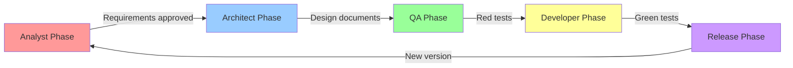

# Шаблон агентской разработки (Agent-Ready Development Template)

[](https://github.com/template/agents_template/actions/workflows/ci-cd.yml)
[](https://codecov.io/gh/template/agents_template)
[]()
[]()

## 📋 Описание

Шаблон для разработки веб- и бэкенд-приложений с соблюдением принципов:
- **DDD (Domain-Driven Design)** - единый язык, доменная модель, агрегаты
- **Чистая архитектура** - разделение на слои Domain/Application/Infrastructure/Interface
- **Контрактная изоляция** - взаимодействие через явные контракты (OpenAPI, Protobuf)
- **KISS** - простые решения без излишней абстракции
- **100% покрытие тестами** - unit, integration, e2e + мутационное тестирование
- **Агентская разработка** - четкие роли субагентов и workflow

## 🚀 Быстрый старт

```bash
# Клонировать шаблон
git clone <repository-url> my-project
cd my-project

# Запустить bootstrap скрипт
./scripts/setup/bootstrap.sh

# Инициализировать pre-commit хуки
git config core.hooksPath scripts/hooks
```

## 📁 Структура проекта

```
project/
├── AGENTS.md                 # Правила для агентов разработки
├── requirements/             # Атомарные требования (одно = один файл)
│   └── TEMPLATE.md          # Шаблон требования
├── docs/
│   └── design/              # Дизайн-документы (ADR)
│       └── TEMPLATE_ADR.md  # Шаблон архитектурного решения
├── src/
│   ├── domain/              # Сущности, Value Objects, Domain Services
│   ├── application/         # Use Cases, Ports (интерфейсы)
│   ├── infrastructure/      # Реализация портов (БД, API, FS)
│   └── interface/           # Контроллеры, DTOs, презентация
├── contracts/               # OpenAPI/Swagger, Protobuf спецификации
├── tests/
│   ├── unit/                # Unit тесты
│   ├── integration/         # Integration тесты
│   ├── e2e/                 # E2E тесты
│   └── mutation/            # Мутационные тесты
├── templates/
│   ├── python/              # Python шаблон (uv, pyproject.toml)
│   ├── nodejs/              # Node.js шаблон (pnpm, package.json)
│   ├── rust/                # Rust шаблон (Cargo.toml)
│   ├── go/                  # Go шаблон (go.mod)
│   └── csharp/              # C# шаблон (Directory.Build.props)
├── scripts/
│   ├── common/              # Общие скрипты (кроссплатформенные)
│   │   ├── validate_requirements.sh
│   │   ├── check_workflow_status.sh
│   │   ├── security-scan.sh
│   │   ├── complexity-check.sh
│   │   ├── format-code.sh
│   │   └── run-tests.sh
│   ├── hooks/               # Git хуки (pre-commit, post-commit)
│   └── setup/               # Скрипты инициализации
├── .github/workflows/       # GitHub Actions CI/CD
└── .gitlab/ci/              # GitLab CI/CD
```

## 👥 Роли субагентов

### 1. Бизнес-аналитик (Business Analyst Agent)
- Уточняет требования через вопросы "5 почему"
- Создает атомарные требования в `/requirements`
- Формирует критерии приемки в формате Given-When-Then

### 2. Архитектор-проектировщик (System Architect Agent)
- Анализирует требования и создает ADR в `/docs/design`
- Проектирует доменную модель и контракты
- Определяет границы модулей и Bounded Contexts

### 3. QA-инженер (Quality Assurance Agent)
- Пишет тесты ДО реализации (TDD/BDD)
- Обеспечивает 100% покрытие unit/integration/e2e
- Создает 2 мутационных теста на каждую функцию

### 4. Разработчик (Developer Agent)
- Реализует код строго по утвержденным тестам
- Соблюдает принципы DDD и чистой архитектуры
- Проходит все проверки CI/CD

## 🔄 Workflow разработки



### Этапы:

1. **Analyst Phase** - Создание и утверждение требований
2. **Architect Phase** - Проектирование решения и контрактов
3. **QA Phase** - Написание "красных" тестов
4. **Developer Phase** - Реализация до прохождения тестов
5. **Release Phase** - Генерация релиза и деплой

## 🛠️ Инструменты

### Безопасность
- **gitleaks** - поиск секретов и токенов
- **trivy** - сканирование уязвимостей зависимостей
- **semgrep** - статический анализ безопасности

### Качество кода
- **lizard** - анализ цикломатической сложности (порог ≤10)
- **pre-commit** - автоформатирование и линтинг

### Тестирование
- **pytest / jest / cargo test / go test / dotnet test** - unit тесты
- **testcontainers** - integration тесты с изоляцией
- **mutmut / cargo-mutants** - мутационное тестирование

### Версионирование
- **Python**: `uv` с `uv.lock`
- **Node.js**: `pnpm` с `pnpm-lock.yaml`
- **Rust**: `Cargo.lock`
- **Go**: `go.mod` + `go.sum`
- **C#**: `packages.lock.json`

## 🎯 CI/CD

Шаблон адаптивен и поддерживает обе платформы:

### GitHub Actions
- Файл: `.github/workflows/ci-cd.yml`
- Матричное тестирование по версиям языков
- Автоматические релизы при тегах `v*`

### GitLab CI
- Файл: `.gitlab/ci/.gitlab-ci.yml`
- Ступенчатый pipeline с кэшированием
- Релизы через GitLab API

### Стадии pipeline:
1. **Detect** - определение измененных файлов
2. **Security** - сканирование безопасности
3. **Complexity** - проверка сложности кода
4. **Test** - запуск тестов для каждого языка
5. **Contracts** - валидация контрактов
6. **Release** - создание релиза (при тегах)
7. **Summary** - итоговый отчет

## 📝 Требования

Формат хранения требований - атомарный (один файл = одно требование):

```markdown
---
id: REQ-001
title: Краткое название
status: draft | approved | implemented | rejected
related: [REQ-YYY, REQ-ZZZ]
---

## Описание
...

## Критерии приемки
1. Given [...], When [...], Then [...]
```

Валидация требований:
```bash
./scripts/common/validate_requirements.sh
```

## 🔍 Проверка статуса workflow

```bash
./scripts/common/check_workflow_status.sh
```

Проверяет:
- Все ли утвержденные требования имеют дизайн-документы
- Наличие тестов для реализованных требований
- Покрытие мутационными тестами

## 🚫 Запрещено

- Прямые зависимости между слоями в обход контрактов
- Бизнес-логика в контроллерах или инфраструктуре
- Игнорирование ошибок или пустые catch блоки
- Коммиты без прохождения pre-commit проверок
- Увеличение цикломатической сложности выше 10
- Отсутствие тестов для нового кода
- Отсутствие мутационных тестов (минимум 2 на функцию)

## 📚 Документация

- [AGENTS.md](./AGENTS.md) - Полные правила для агентов
- [Требования](./requirements/) - Функциональные требования
- [Дизайн-документы](./docs/design/) - Архитектурные решения (ADR)
- [Контракты](./contracts/) - API спецификации

## 🔧 Настройка pre-commit хуков

```bash
# Локальная настройка
git config core.hooksPath scripts/hooks

# Или установить глобально
git config --global core.hooksPath $(pwd)/scripts/hooks
```

## 🌐 Поддерживаемые языки

| Язык | Версии | Инструменты |
|------|--------|-------------|
| Python | 3.9 - 3.12 | uv, pytest, mutmut |
| Node.js/TS | 18 - 22 | pnpm, jest, stryker |
| Rust | stable | cargo, cargo-mutants |
| Go | 1.20 - 1.22 | go test, gobugfree |
| C# | .NET 8 | dotnet test, Stryker.NET |

## 📄 Лицензия

MIT License - см. [LICENSE](./LICENSE) файл.
