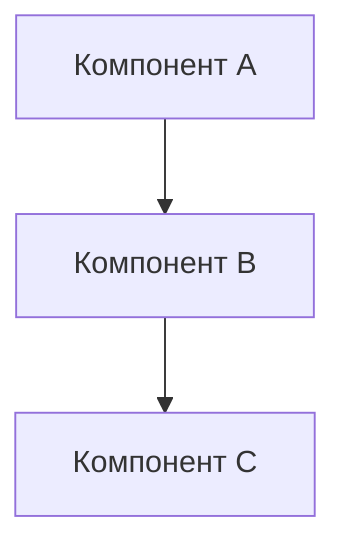

## Контекст и проблема
Опишите контекст, в котором принимается решение, и проблему, которую оно решает.
Ссылайтесь на требования из `/requirements`, которые обосновывают необходимость этого решения.

## Рассмотренные альтернативы

### Альтернатива 1
**Описание:** ...
**Преимущества:** ...
**Недостатки:** ...

### Альтернатива 2
**Описание:** ...
**Преимущества:** ...
**Недостатки:** ...

## Выбранное решение
**Описание:** Подробно опишите выбранное решение.

**Обоснование:** Почему эта альтернатива была выбрана?

## Схема взаимодействия компонентов

## Последствия принятия решения

### Положительные
- ...
- ...

### Отрицательные (риски, компромиссы)
- ...
- ...

## Влияние на доменную модель
Опишите изменения в сущностях, value objects, агрегатах.

## Контракты
Перечислите новые или измененные контракты (API, сообщения, события).

## Статус реализации
- [ ] Доменная модель обновлена
- [ ] Контракты определены
- [ ] Тесты написаны (QA Phase)
- [ ] Реализация завершена
